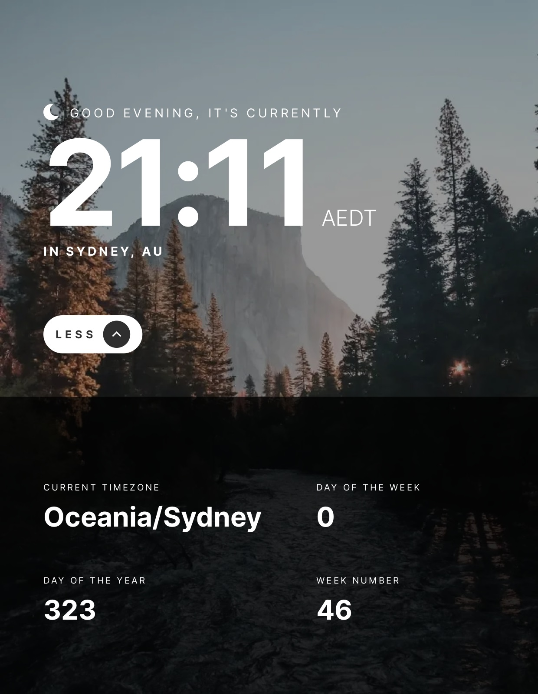

# Clock app

This is my implementation of the Clock app.

## Table of contents

- [Overview](#overview)
  - [The project](#the-project)
  - [Screenshot](#screenshot)
- [My process](#my-process)
  - [Built with](#built-with)
  - [What I learned](#what-i-learned)
  - [Useful resources](#useful-resources)
- [Author](#author)

## Overview

### The project

Users should be able to:

- View the optimal layout for the site depending on their device's screen size
- See hover states for all interactive elements on the page
- View the current time and location information based on their IP address
- View additional information about the date and time in the expanded state
- Be shown the correct greeting and background image based on the time of day they're visiting the site
- Generate random quotes by clicking the refresh icon near the quote

### Screenshot



## My process

### Built with

- [React](https://reactjs.org/) - JS library
- [Next.js](https://nextjs.org/) - React framework
- [Sass](https://sass-lang.com/) - For styles
- [SWR](https://swr.vercel.app/) - For data fetching
- CSS custom properties
- CSS Flexbox
- CSS Grid

### What I learned

I choosed SWR when it comes to data fetching on mount, and I wrapped the fetching logic in my custom React hooks, such as useIP and useTime. I really liked this pattern.

```js
import useSWR from 'swr';

async function fetcher(endpoint) {
  const response = await fetch(endpoint);
  if (!response.ok) {
    throw new Error('Something went wrong');
  }
  const json = await response.json();
  return json;
}

function useTime(ENDPOINT) {
  const { data } = useSWR(ENDPOINT, fetcher);

  return {
    dayofyear: data?.day_of_year,
    dayofweek: data?.day_of_week,
    weeknumber: data?.week_number,
    timezone: data?.abbreviation,
    time: data?.datetime.substr(11, 5),
    hour: data?.datetime.substr(11, 2),
  };
}

export default useTime;
```

### Useful resources

- [Environment Variables](https://blog.logrocket.com/customizing-environment-variables-next-js-13/) - This helped me for dealing with API key.

## Author

- Website - [Jett Zhang](https://github.com/seamissu)
